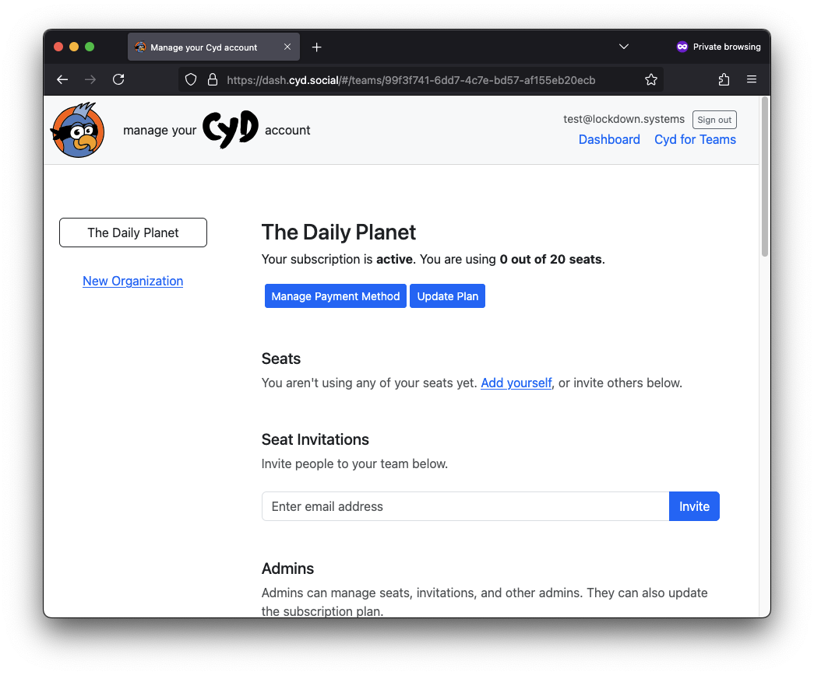

# Teams Dashboard

After creating an organization and purchasing seats, the Cyd for Teams dashboard looks like this:

If you want to use Cyd yourself, click **Add yourself**.

## Manage Seats

There are two ways to add new seats to your account. You can invite people using their email addresses, or you can add a domain name to your account, which is described [below](#add-your-domain-name).

### Inviting People to Your Team

To invite someone, under **Seat Invitations**, enter their email address and click **Invite**. This will create a seat invitation and email them a link they can use to join your Cyd team. After inviting someone, you can click **Copy Link** to copy the link to your clipboard, which lets you send it to them some other way.

Seat invitations use up the number of seats you've paid for. If someone is not accepting a seat invitation, you can cancel their invitation to get the seat back.

If you invite someone to your team who already has a Cyd account, it will automatically add them to your team rather than making them click a link.

### Removing People From Your Team

If you need to offboard a team member, find them under **Seats** and click **Delete**.

This will recover their seat, which you are free to assign to someone else.

## Manage Admins

Admin users have the ability to add and delete seats, add and delete other admins, and update your subscription plan.

Just like with seats, you can invite users to become admins using their email addresses. Admins can also delete admin access from other admins. Admins cannot remove admin privileges from organization owner.

:::tip Admins don't take up seats

Admin users don't necessarily need to use up one of the seats you're paying for too &dash; for example, if you work for a Managed Service Provider and provide IT support for your clients, you can have an admin user without your client having to pay for it.

:::

## Add Your Domain Name

If you have many people on your team, it will likely be more convenient to add your organization's domain name and let your team sign up on their own. Cyd for Teams makes this easy.

Under **Domains**, just add your domain name and click the **Add Domain** button.

For example, if your organization's domain name is `example.com` and you add this domain, if `alice@example.com` email address signs into Cyd, she will automatically join your team and take up one seat.

:::tip Onboarding and offboarding is easy

If you add your domain to Cyd, all you have to do to onboard your employees is let them know they have free access to Cyd. When an employee leaves, you need to login to the Cyd for Teams dashboard and delete their seat. That's it.

:::

:::warning What happens when you run out of seats

If someone signs up to Cyd using an email address with your organization's domain, but you don't have any seats available, the person won't get added to your team automatically.

If you update your subscription to add more seats, you'll need to manually invite the user that was unable to automatically join your team.

:::

## Organization Settings

Only organization owners can change organization settings. If you're the owner (the person who initally set it up), you can:

- Change the name of your organization.
- Change the owner of your organization to an existing admin. If you do this, you immediately lose the ability to change organization settings. The the new owner has this power now.

## Email Notification Preferences

Admins can choose to get notified by email:

- When new seats are added to the organization
- When all seats are filled

## Invoices

At the bottom of the Cyd for Teams dashboard, you can download all invoices that you've paid.