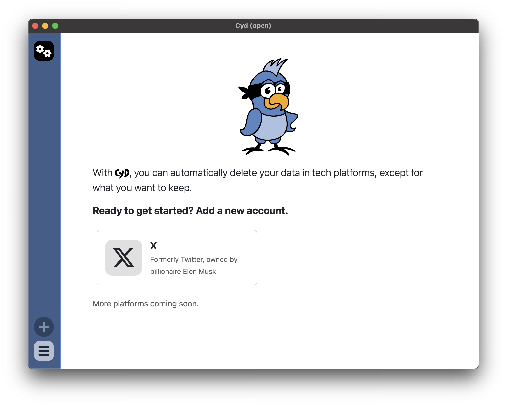
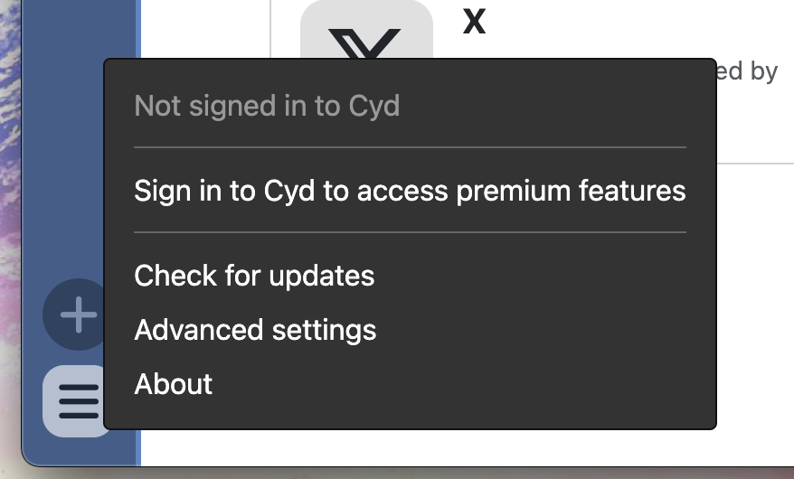
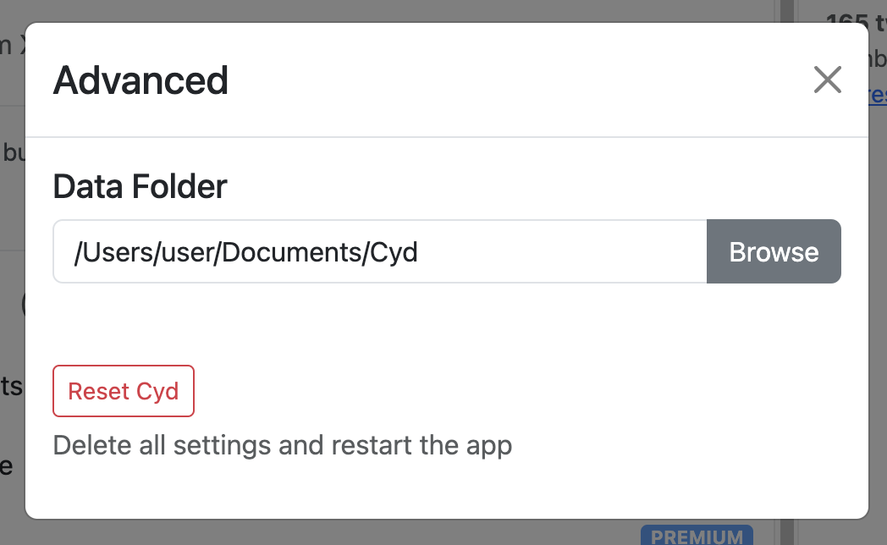

# Tour of Cyd

When you open Cyd for the first time, you'll see a window like this:

## Main panel

Most of the window shows the currently selected account. Since you haven't added any accounts yet, you're presented with the option to add a new account. At the moment, only the X platform is supported.

Read more about [signing into your X account](../x/sign-in).

## Sidebar

At the top of the left sidebar, all of your logged in accounts are listed. In the screenshot above, there is a single gear icon, which means that the account has still not been selected, and no other accounts are logged in yet.

At the bottom of the left sidebar, there are two icons:

- The `+` icon adds a new account to Cyd. You can add as many accounts as you wish.
- The `≡` icon opens the menu.

When you click the menu icon, a menu like this will appear:

From here, you can do the following:

- **Sign into a Cyd account.** This is only necessary if you have a [Premium plan](../premium/intro). If you're already signed in, you can manage your Cyd account.
- **Check for Cyd updates.** Cyd will automatically check for updates in the background, but you can manually check here as well. We recommend that you always upgrade to the latest version of Cyd.
- **Open advanced settings.** These are described below.
- **View the about page.** This shows you the version of Cyd you're currently running.

### Advanced settings

The advanced settings dialog looks like this:

#### Data Folder

When Cyd builds local databases of your data on tech platforms, by default it stores this data in your computer's `Documents` folder. If you prefer to save your Cyd data somewhere else, you can update your Data Folder here here. If you change your Data Folder, make sure to move any existing Cyd data that you have to the new location.

#### Reset Cyd

If you're having problems with Cyd, you can try resetting all settings with the "Reset Cyd" button. This will start Cyd over from a clean slate.

:::info
Resetting Cyd won't touch your Data Folder, so you won't lose any data. You'll just need to login to your accounts again.
:::

## Using Cyd

Each platform that Cyd supports works in its own unique way. To learn how to use each platform, refer to the documentation for that platform:

- [X (formerly Twitter)](../x/sign-in)
- _More platforms coming soon..._
