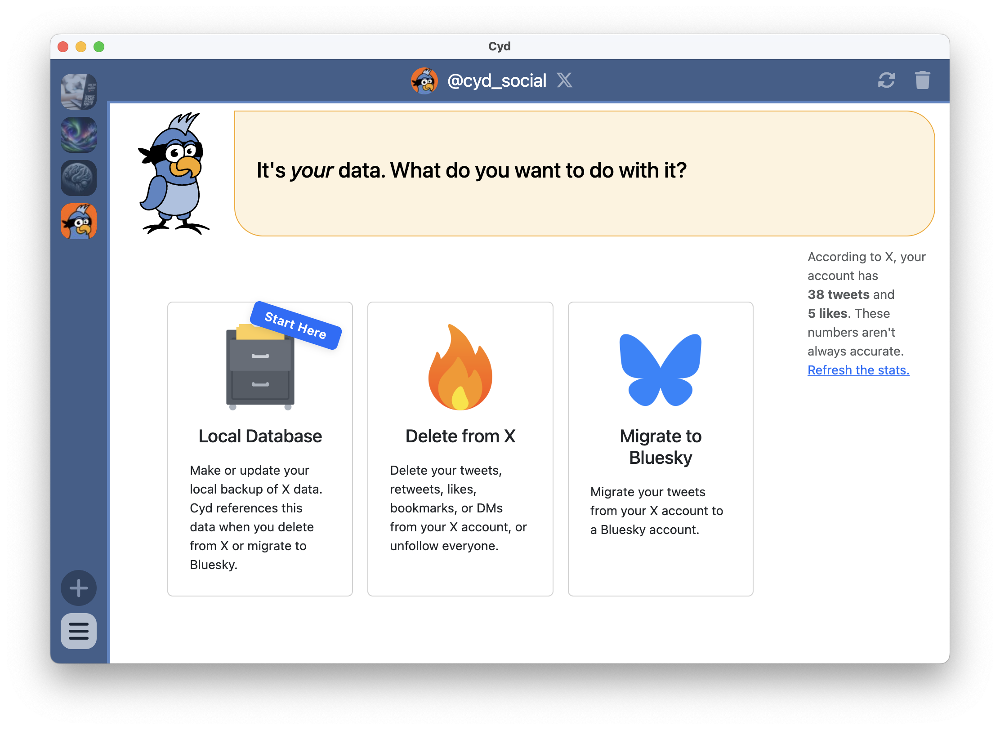

# Welcome to Cyd

Cyd is an open source app for Windows, Mac, and Linux that makes it easy for you to claw back your data from Big Tech platforms. Right now Cyd supports X, but more platforms (*cough Facebook cough*) are coming soon.

Cyd helps you create a local, private backup of your data &mdash; like all of your tweets, retweets, likes, bookmarks, and direct messages. Once you've done this, Cyd helps you choose what data you want to delete from your online account. You can delete it all, or you can be selective, deleting most of it but keeping what went viral. It can also help you migrate your data from closed platforms into open ones &mdash; for example, you can migrate your tweets from X into Bluesky.

## Free and Premium Features

Cyd is developed by the [Lockdown Systems Collective](https://lockdown.systems), a worker-owned cooperative. Even though it's open source &mdash; you can check out the code [on GitHub](https://github.com/lockdown-systems/cyd) &mdash; some of the features cost money. By running the collective as a sustainable business, we can make a living continually improving Cyd.

You can [download the Cyd app](https://cyd.social/download/) for free, and you can use it without buying anything or signing up for an account. If you try to use a premium feature, you will be prompted to sign up and pay for a Premium plan.

In general, the features that help you to save copies of your data are free, and the features that help you delete your data require a Premium plan. We make some exceptions to this though. For example, it's free to delete all of your tweets from X, but you'll need a Premium plan if you want to choose to keep the ones that went viral.

Check out the [Pricing page](https://cyd.social/pricing/) for details on how much Premium plans cost and what features they include. We try to keep it very affordable &mdash; about half the price of a cup of coffee each month.

## Cyd for Teams

If you run a business or an organization and would like to give your employees privacy, peace of mind, and protection from doxing and harassment (*ehem*, newsrooms, I'm looking at you), then Cyd for Teams is for you.

Cyd for Teams gives you central management and billing of Premium plans for everyone at your organization. You can invite individual people to your plan, or anyone who signs up with Cyd using an email address from your organization's domain they can get added automatically. Seats are transferrable, so if one employee leaves you can give that seat to the next person without needing to buy new seat.

To get started, load the [Cyd for Teams page](https://dash.cyd.social/#/teams/new) on the Cyd Dashboard. If you don't have a Cyd account yet, create one by entering your email address. From there, you can create a new organization and sign up for a Cyd for Teams plan.

## Support

If you need help with Cyd, contact collective@lockdown.systems.

## In the Media

### December 13, 2024 | Lifehacker

[**This Free App Archives and Deletes Your Tweets**](https://lifehacker.com/tech/cyd-app-archives-and-deletes-tweets-for-free) by Justin Pot

> Want to delete all of your tweets? Cyd, an application for Windows, macOS, and Linux, automates the process for you and even gives you an offline archive. Even better: This application runs entirely on your computer, meaning you don't need to trust a third party with access to your account in order to use it.

### December 11, 2024: Freedom of the Press Foundation

[**Clawing back your data on X**](https://freedom.press/digisec/blog/clawing-back-your-data-on-x/) by Dr. Martin Shelton

> Just as journalists are making the jump to Bluesky, it’s become easier than ever to remove old posts on X. Our former board member Micah Lee created a new piece of software called Cyd, which helps you remove your data from X, with plans to extend this functionality to other social media sites like Facebook and Reddit. Instead of using the old developer tools, which have become prohibitively expensive in recent years, Cyd bypasses these limitations by essentially doing what any user would have to do manually in their browser: The software scrolls through the website and clicks the “delete” button, over and over again.

### December 3, 2024: WIRED

[**He Got Banned From X. Now He Wants to Help You Escape, Too**](https://www.wired.com/story/x-delete-posts-cyd-micah-lee/) ([archive link](https://archive.is/BwoxG)) by Andy Greenberg

> When programmer Micah Lee was kicked off X for a post that offended Elon Musk, he didn’t look back. His new tool for saving and deleting your X posts can give you that same sweet release.

### December 3, 2024: ZDNet

[**I deleted thousands of tweets from X with this new tool - for free**](https://www.zdnet.com/article/i-deleted-thousands-of-tweets-from-x-with-this-new-tool-for-free/) by Jason Perlow

> Now you can easily migrate from X with this powerful tool that deletes tweets, likes, and DMs, while backing up your data for a fresh start elsewhere. 
