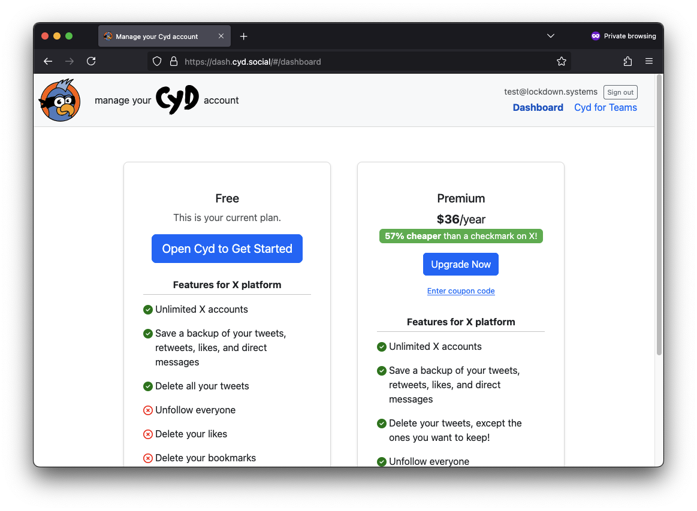

# Sign Up for Premium

You can manage your Cyd account from the [Cyd Dashboard](https://dash.cyd.social/).

To sign up, enter an email address. After verifying your email address, the dashboard will look like this:

The left column shows the features of the free plan, and the right column shows the price and the features of the Premium plan. When you're ready to upgrade to Premium, click **Upgrade Now**.

On the next page, enter your payment info. And then that's it! You have a Premium account and you can use all of the Premium features in Cyd.

Within the Cyd app, click the menu icon (`≡`) in the bottom left to sign into your Cyd account, or to manage your Cyd account if you're already signed in.