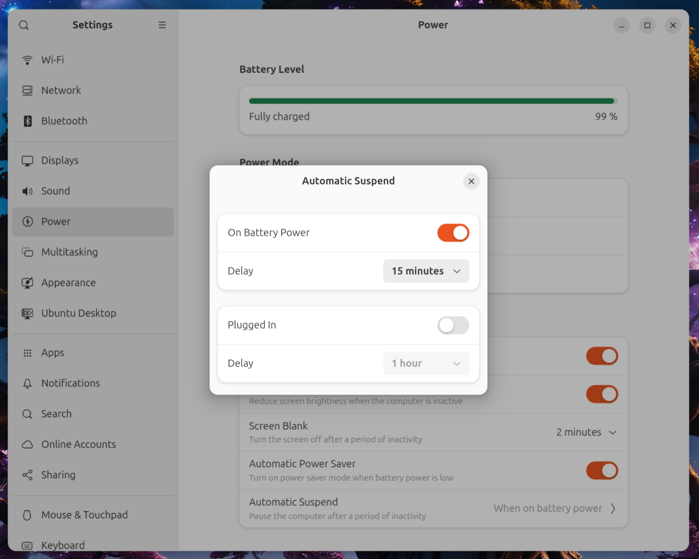

# Disable Sleep in Linux

Cyd runs directly on your computer. If you need to run it for hours or days (X has some annoying rate limits, so this possible), you should prevent your computer from going to sleep while it's working.

Follow these instructions to temporarily prevent your computer from going to sleep in Ubuntu. (The steps should be similar for other Linux distributions too.)

First, make sure your computer is plugged in while running a Cyd job.

Second, make sure your computer does not automatically go to sleep after being idle when plugged in:

- Open the **Settings** app
- Choose **Power** in the left panel
- Under **Power Saving**, click **Automatic Suspend**
- Make sure it's disabled under **Plugged In**

Now you can safely run Cyd for an extended period of time without.

:::warning Keep your laptop lid open

Note that your computer will still go to sleep if you close the laptop lid. So, don't close your laptop while you're doing a long-running Cyd session.

:::