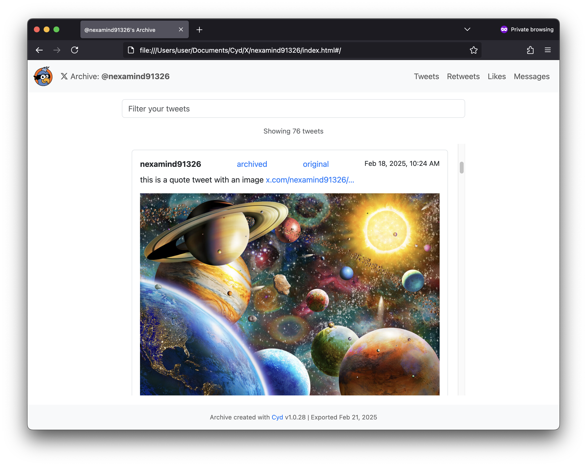
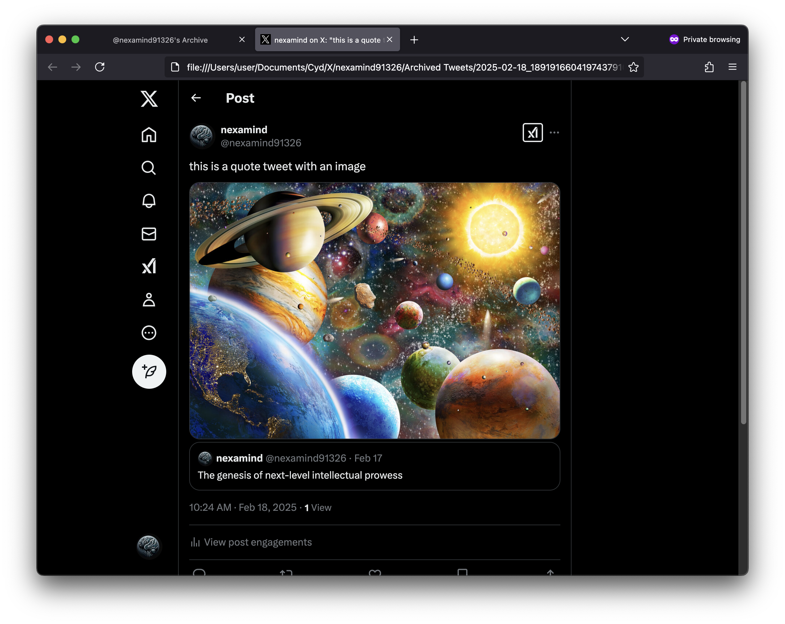
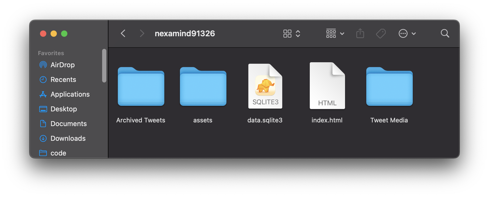

# Browse Your Local Archive

When you build your local database for each X account, Cyd saves your data in your `Documents` folder on your computer. For example, if your X username is `cyd_social`, your Cyd data will be stored in `~/Documents/Cyd/X/cyd_social`.

This folder includes `index.html` which contains an archive website that you can use to browse your data locally. For the nerds out there, it also contains `data.sqlite3` &mdash; the raw database, in SQLite3 format.

If you ever need to find your local archive, you can open Cyd, select your X account, and click the **Browse Archive** and **Open Folder** buttons in the right sidebar. These buttons won't appear until you build your local database for the first time.

## Cyd's Archive Website

By clicking **Browse Archive**, or loading `index.html` in a web browser, you can browse the X data from your local database. For example, here's a screenshot of looking through tweets:

In the top-right of this website, there are navigation buttons for each type of data you have saved from your X accounts: tweets, retweets, likes, direct messages, and bookmarks.

You can filter your data using the filter input field at the top.

Each tweet contains the following information:

- The tweet itself: the username, date, and content of the tweet, including media, as well as number of retweets and likes.
- The date you saved the tweet, and the date you deleted it (if you deleted it with Cyd).
- If you used Cyd to save an archived HTML version of the tweet, a link called **archived** to this local HTML file.
- A link called **original** to the original URL of the tweet, hosted at x.com.

If you saved an archived HTML version of the tweet, here's what it looks like:

Within your local archive, if you saved direct messages, you can browse and filter those as well.

## Exploring the Files

Here are the files and folders that Cyd creates when you build your local database:

- `Archived Tweets`: If you saved archived HTML versions of your tweets, this folder contains a different HTML file for each tweet, named after the date of the tweet and its tweet ID.
- `assets`: Web assets used by your local archive website. This includes `assets/archive.js`, which contains a copy of your X data in JSON format.
- `data.sqlite3`: A copy of your X data, in SQLite3 format.
- `index.html`: Your local archive website. Open this in a web browser to browse your archive website.
- `Tweet Media`: Images and videos embedded in your tweets, retweets, likes, and bookmarks.
