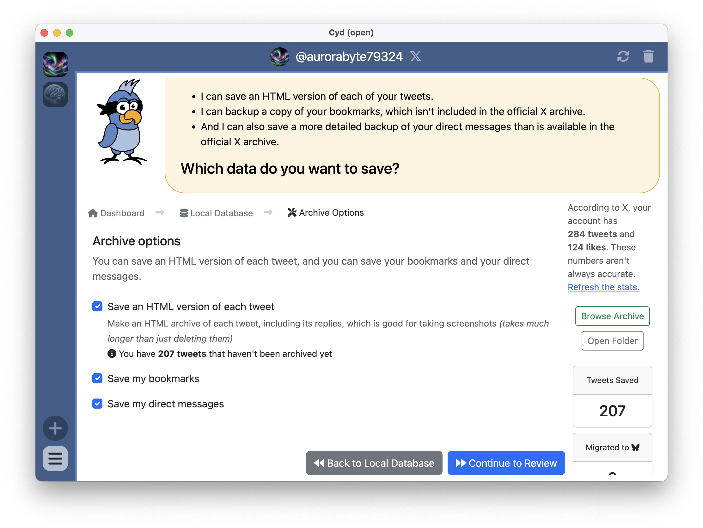
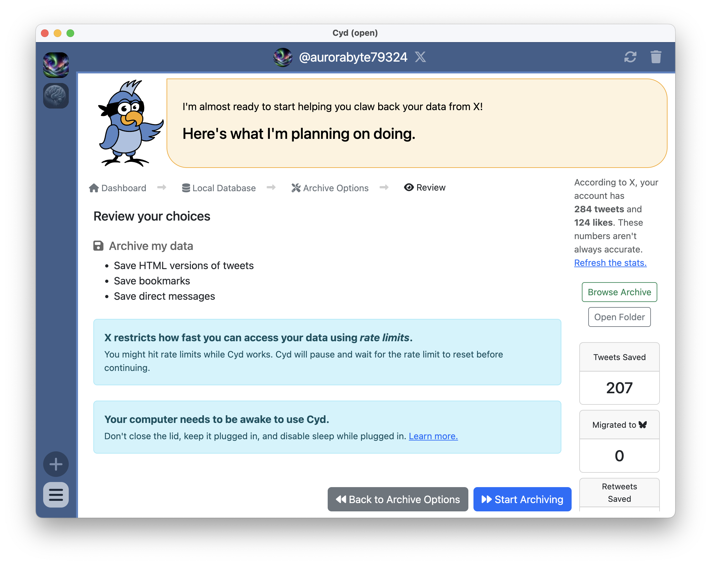
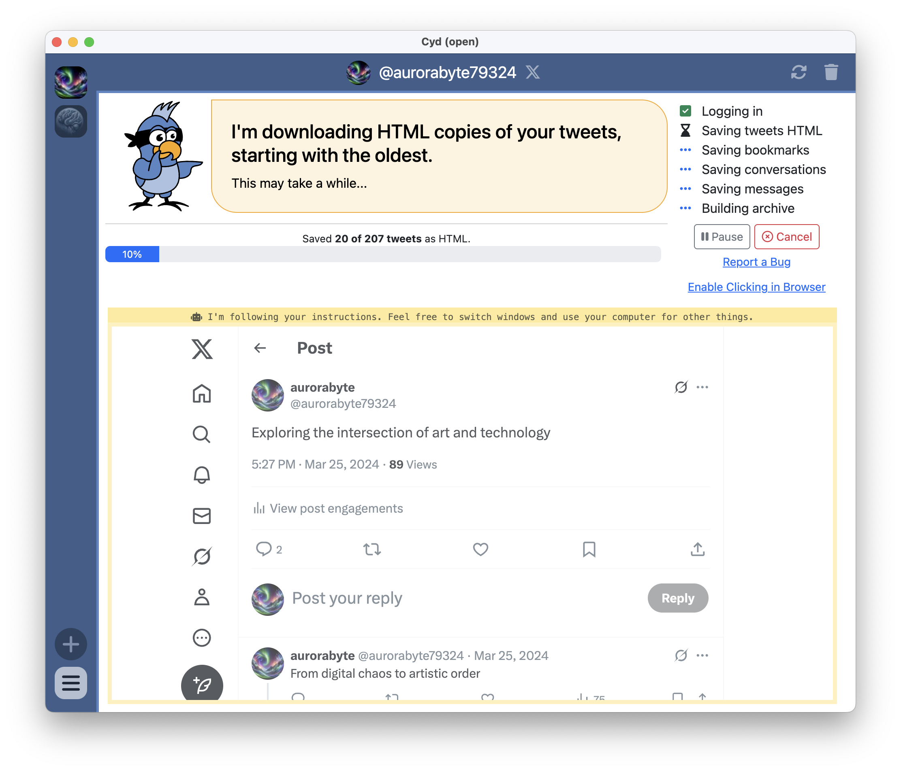

# Save HTML Tweets, DMs, and/or Bookmarks

If you built your database from scratch, you can skip this section.

If you imported from an X archive though, you may wish to proceed with this section. X only gives you some of your data when you request an archive. Using this feature, Cyd can help you archive more of your data.

## Archive Options

If you choose to archive additional data, you will see the following Archive Options screen.

Here is a description of each option:

- **Save an HTML version of each tweet:** Make an HTML archive version of each of your tweets. This takes a long time, so only check this box if you care about this.
- **Save my bookmarks:** Scroll through your tweet timeline and save information about each bookmark.
- **Save my direct messages:** Scroll through your direct message conversations and save information about each conversation. Then, for each conversation, scroll through the message history and save information about each message.

## Review

When you click **Continue to Review**, you have a chance to review your options before proceeding:

When you're ready, click **Start Archiving**.

:::tip Disable sleep

Depending on how much data you have in your X account and how often X rate limits you, archiving additional data could take a long time. Make sure to disable sleep on your computer. There are guides for how to do this in the [Disable Sleep](../../tips/disable-sleep/intro) section.

:::

## Archiving Additional Data

When you start archiving additional data, you can watch the embedded browser to see Cyd work.

:::warning Rate limits

Cyd saves your data as fast as it can, but X imposes limits on how fast this is. These are the same limits you would hit if you manually scrolled through your X account really, really fast.

If you hit a rate limit, Cyd will wait for it to expire. Typically, you will need to wait less than 15 minutes before you can proceed. The second that X's rate limit expires, Cyd goes back to work saving your data.

:::

## Finished

When Cyd is done archiving additional data, it shows you a summary of what it saved:

