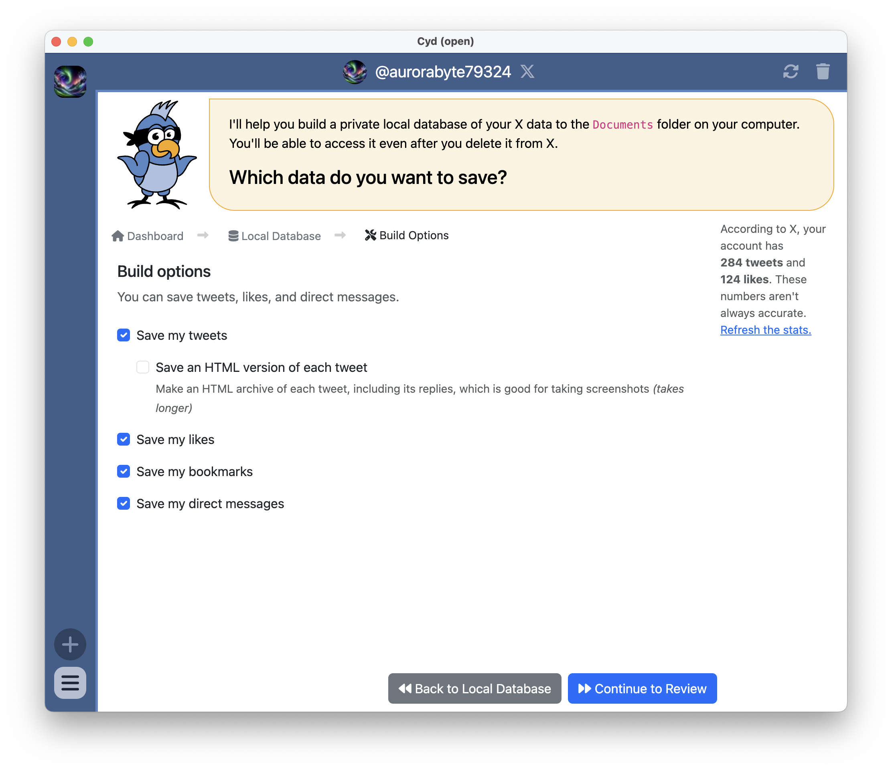
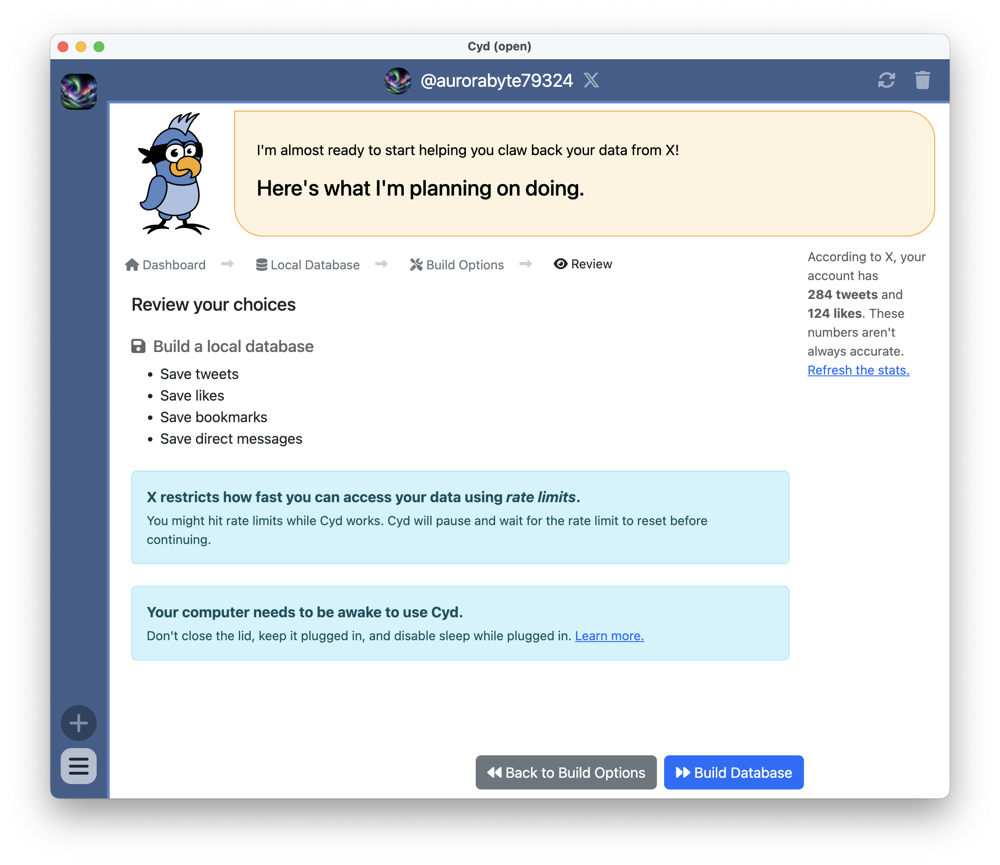
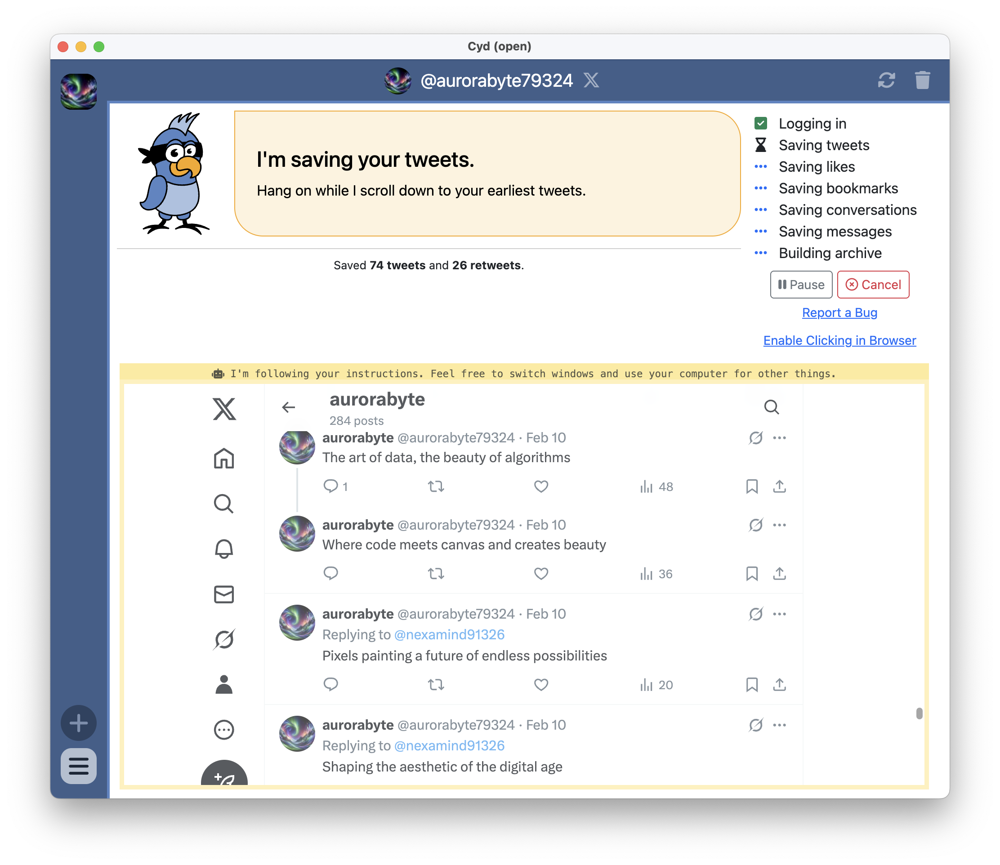
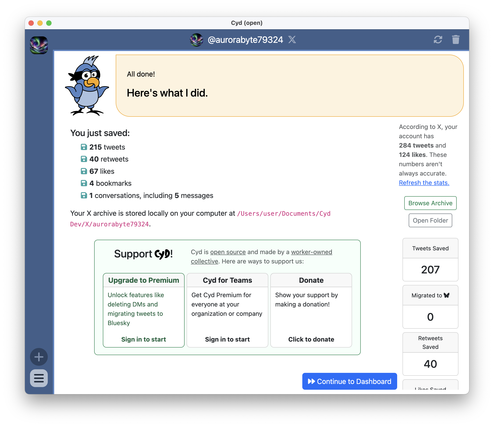

# Build Database from Scratch

When you build your database from scratch, Cyd learns your tweet history the same way you would: By loading your profile to see your tweets, then scrolling down over and over until it gets to the bottom. If you don't have a lot of data in your X account, this is the best way to build your database.

:::warning Limits to building a local database from scratch

Unfortunately, X will only show you about between 2,000 and 3,000 of your most recent tweets and likes in this way. Even if you delete all of those, X simply won't show you any of your tweet or like history on your profile page anymore, even if you have thousands of older tweets.

If your account has a lot of data, you should [import data from an X archive](./import) instead.

:::

## Build Options

If you choose to build your database from scratch, you will see the following Build Options screen.

Here is a description of each option:

- **Save my tweets:** Scroll through your tweet timeline and save information about each tweet.
  - **Save an HTML version of each tweet:** Make an HTML archive version of each of your tweets. This takes much longer, so only check this box if you care about this.
- **Save my likes:** Scroll through your tweet timeline and save information about each like.
- **Save my bookmarks:** Scroll through your tweet timeline and save information about each bookmark.
- **Save my direct messages:** Scroll through your direct message conversations and save information about each conversation. Then, for each conversation, scroll through the message history and save information about each message.

## Review

When you click **Continue to Review**, you have a chance to review your options before proceeding:

When you're ready, click **Build Database**.

:::tip Disable sleep

Depending on how much data you have in your X account and how often X rate limits you, building your database could take a long time. Make sure to disable sleep on your computer. There are guides for how to do this in the [Disable Sleep](../../tips/disable-sleep/intro) section.

:::

## Building Your Database

When you start building your database, you can watch the embedded browser to see Cyd work. You'll see your tweets, likes, and other data scroll by.

As Cyd works, you can see what step it's currently on. In the screenshot above, it finished the "Logging in" step and it's working on the "Saving tweets" step. At any point you can click **Pause** to pause Cyd's work, or **Cancel** to cancel the work completely.

:::warning Rate limits

Cyd saves your data as fast as it can, but X imposes limits on how fast this is. These are the same limits you would hit if you manually scrolled through your X account really, really fast.

If you hit a rate limit, Cyd will wait for it to expire. Typically, you will need to wait less than 15 minutes before you can proceed. The second that X's rate limit expires, Cyd goes back to work saving your data.

:::

:::info Clicking in the browser

When Cyd is controlling the embedded browser on your behalf, clicking in it is disabled, as you might mess with what Cyd is trying to do. However, if you ever encounter a situation where Cyd is stuck and would continue if only you could click something, you can click the **Enable Clicking in Browser** to allow you to click. You can click **Disable Clicking in Browser** disables this again.

:::

## Finished

When Cyd is done building your database, it shows you a summary of what it saved:

In the right sidebar, you will also see the buttons **Browse Archive** and **Open Folder**. See [Browse Your Local Archive](../archive) for more information about these.

There is also a summary of the amount of data in your local database. In the screenshot above, you can see the local database contains 317 saved tweets, 53 saved retweets, and 68 saved likes. So far, none of the tweets have been migrated to Bluesky.