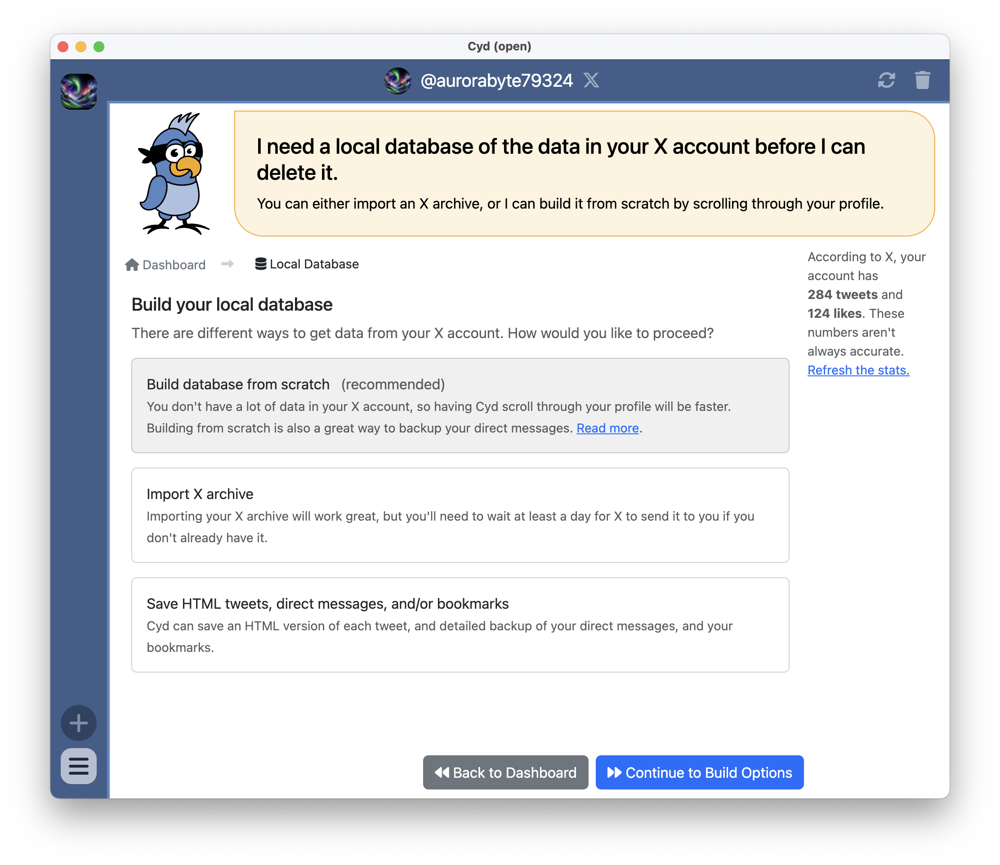

# Introduction

After signing in to your X account, you'll see that the main panel has a right sidebar which includes buttons to navigate between the different features:

- Local Database (this is where you are now)
- [Delete from X](../delete)
- [Migrate to Bluesky](../migrate-bluesky)

The sidebar also includes an estimate of the number of tweets and likes in your X account. While these numbers are often close to your actual number of tweets and likes, they are often inaccurate.

Cyd stores the data from your X account &mdash; your tweets, likes, bookmarks, direct messages, and so on &mdash; in a local database in the `Documents` folder on your computer.

Before deleting your tweets, or migrating them to Bluesky, you need to create a local database of your data. When you instruct Cyd to delete tweets, it will reference this database. If you've built your database before, you can update it with the latest data from your X account by building it again.

There are three different ways of building your local database:

- [Build Database from Scratch](./build): Cyd can scroll through your data to discover it.
- [Import X Archive](./import): You can import an official archive from X.
- [Save HTML Tweets, DMs, and/or Bookmarks](./archive): Cyd can scroll through your data to import types of data that aren't included in the official archive.