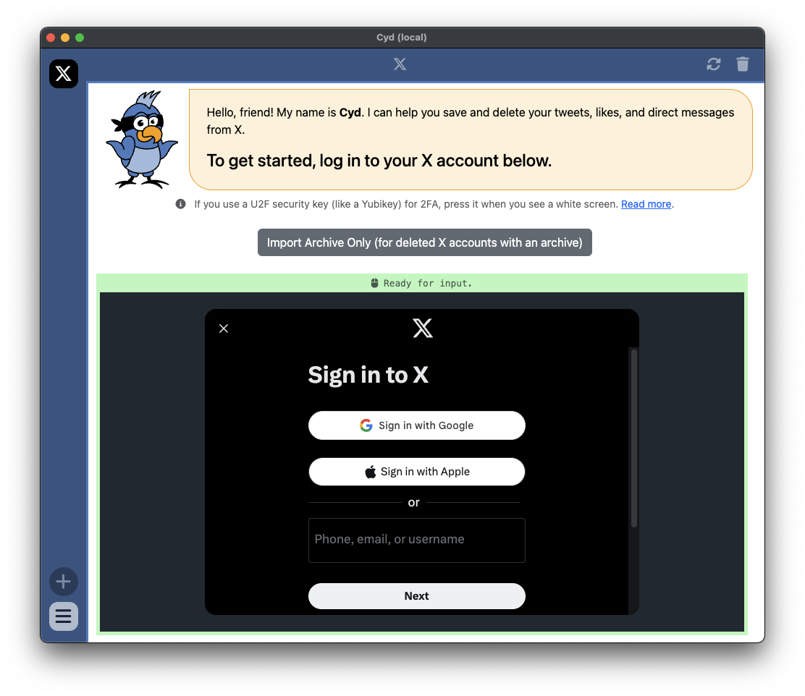

# Sign In to X

When you're on the new account screen in Cyd, choose the X platform. You'll see the following screen:

Cyd (the bird) is at the top of the window giving you instructions, and the bottom part of the window is Cyd's embedded web browser.

:::tip The Cyd server doesn't have any access to your password or your data
When you sign into your X account within Cyd's embedded browser, it's the same as signing in using any other browser on your computer: **Your password is sent directly from your computer to X's servers and it's encrypted using HTTPS. Cyd's server doesn't collect your password or have any access to your account.** Only the Cyd app running locally on your computer does.
:::

Go ahead and sign in to your X account using your username and password.

:::info Do you use 2FA?
If you protect your X account with two-factor authentication, you'll need to enter the 2FA code you get to sign in here too. If you use a U2F security key (like a Yubikey), the screen will turn white when it's time for you to press the button. [Read more](./tips/u2f).
:::

After you sign in, Cyd will immediately start driving your browser to determine your username, your profile picture, and an estimate of the number of tweets and likes in your X account.

When it's done, you'll end up at the Dashboard screen. Continue to [Dashboard](./dashboard).
