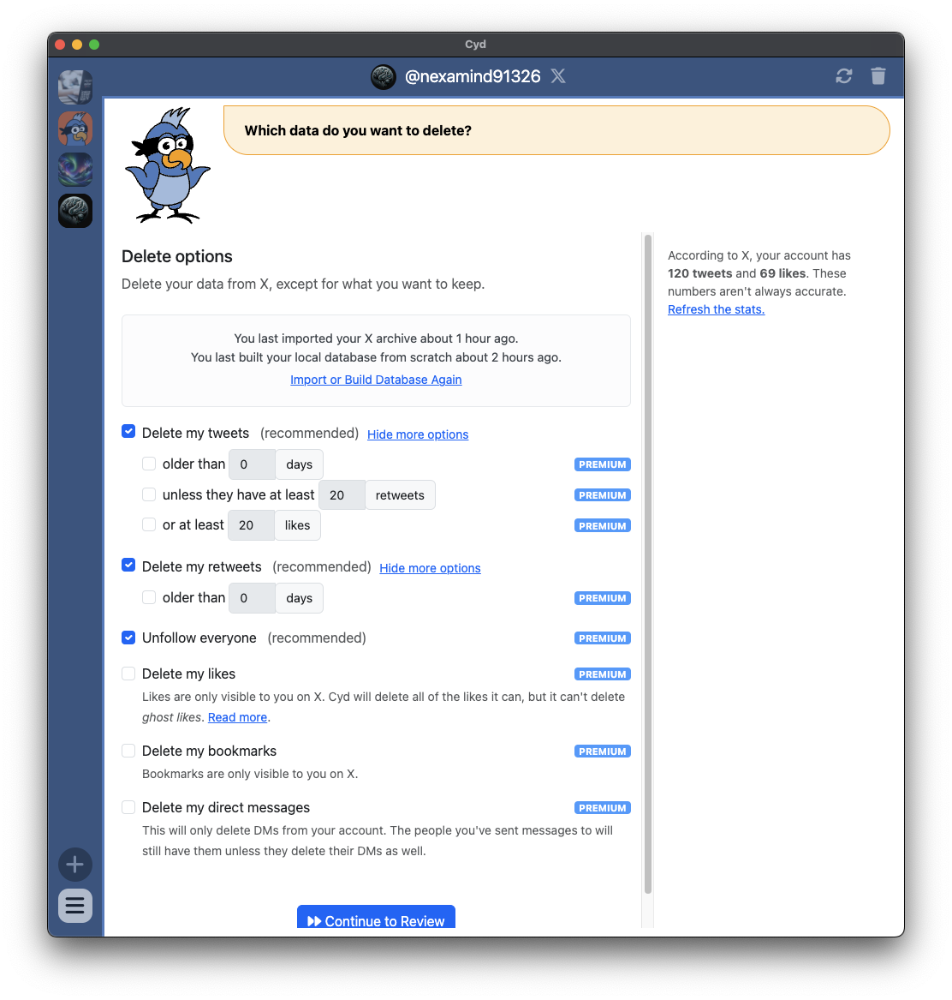
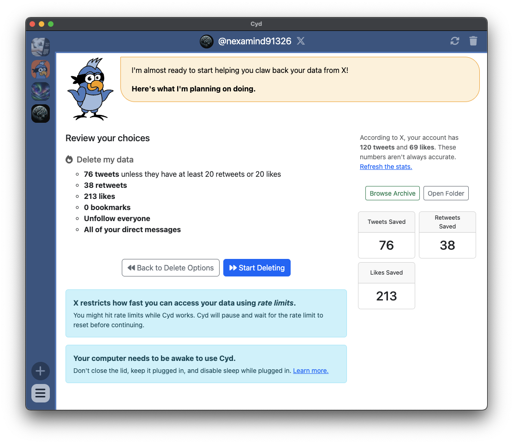
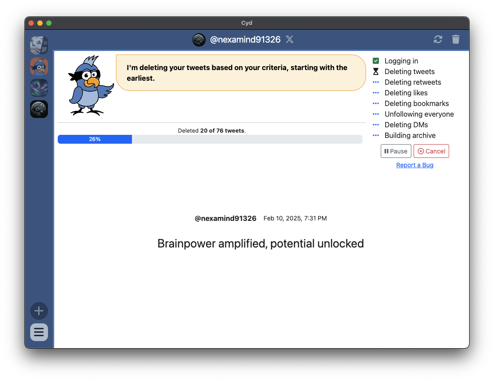
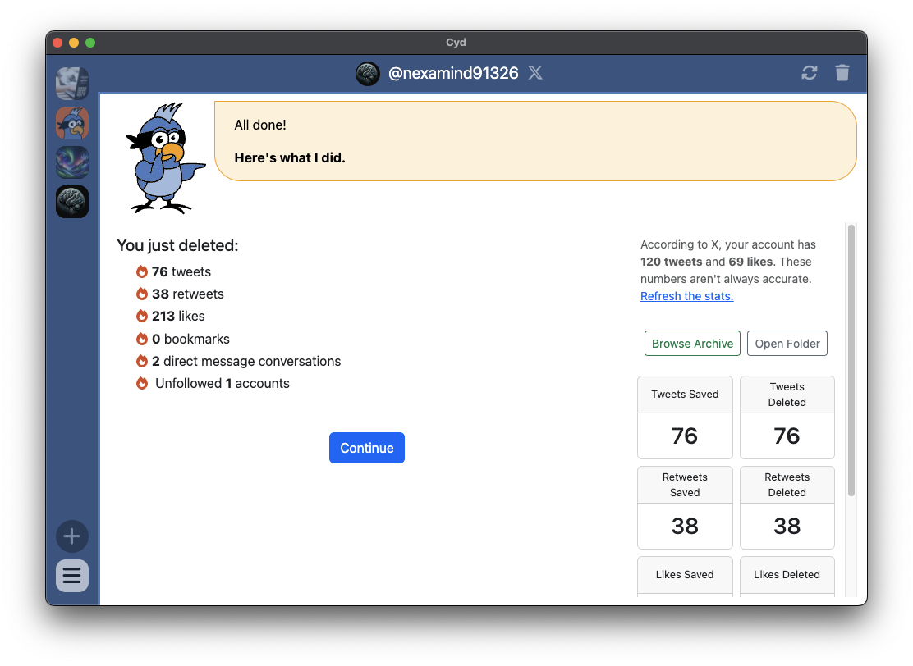

# Delete from X

Once you've built your local database, you're ready to delete data from X!

## Delete Options

When you're ready to delete your data, you will see the following Delete Options screen.

Here's a description of each option:

### Delete my tweets

Delete the **tweets** in your account. If you don't check any checkboxes that modify it below, this will delete *all* of your tweets. Optionally, you can choose which tweets you want to keep:

- **older than __ days**: You can choose to only delete older tweets. For example, if you want your X account to be ephemeral, you can choose to delete everything older 30 days.
- **unless they have at least __ retweets**: You can see a retweets threshold, allowing you to keep tweets that went viral.
- **unless they have at least __ likes**: You can see a likes threshold, allowing you to keep tweets that went viral.

:::tip

We recommend that you delete as many tweets as you feel comfortable with.

:::

### Delete my retweets

Delete the **retweets** in your account. If you don't check any checkboxes that modify it below, this will delete *all* of your retweets. Optionally, you can choose which retweets you want to keep:

- **older than __ days**: You can choose to only delete older retweets.

:::tip

We recommend that you delete all of your retweets.

:::

### Unfollow everyone

Unfollow everyone.

:::tip

If you're abandoning your X account, we recommend that you do this. The list of people you used to follow on Twitter can be very revealing about you.

:::

### Delete my likes

Delete all of the **likes** in your account.

:::info Likes are private

Likes are only visible to you on X (and, of course, to Elon Musk, X's employees, and anyone who can hack your X account). If you're primarily concerned about cleaning up OSINT crumbs about yourself, deleting your likes are optional.

If you've been liking tweets for a very long time, there's a good chance that many of your old likes are [ghost likes](./tips/ghost-likes) and cannot be deleted.

:::

### Delete my bookmarks

Delete all of the **bookmarks** in your account.

Bookmarks are private in X.

### Delete my direct messages

Delete all of the **direct messages** in your account.

This will only delete the direct messages from your account. The people you've sent messages to will still have copies of them unless they delete their direct messages too.

:::tip

Even though direct messages are private, and deleting them only deletes them for you, we still recommend that you delete them all.

If you've been using X for years there's a good chance you have a lot of private messages in there. If your X account ever gets hacked, the hacker will have access to them all. The same is true if X ever decides to dig through your messages or share them with anyone.

:::

## Free and Premium Features

Some of the Delete Options require a Premium plan - [learn more about Premium plans here](../premium/intro). And some of the options are free. If you're only using free options, there's no reason to create a Cyd account or sign up for a Premium plan.

It's free to:

- Delete *all* of your tweets
- Delete *all* of your retweets

You need a Premium plan to:

- Choose to keep tweets older than a specific date, or that don't meet a retweets or likes threshold
- Choose to keep retweets older than a specific date
- Unfollow everyone
- Delete your likes
- Delete your bookmarks
- Delete your direct messages

## Review

When you click **Continue to Review**, you have a chance to review your options before proceeding:

When you're ready, click **Start Deleting**.

## Deleting

Cyd is very fast at deleting tweets, retweets, likes, and bookmarks. You can watch your data flash before your eyes as Cyd deletes it from X.

For these types of data, you can't watch Cyd work in the embedded browser because instead of clicking around as you, it relies on a JavaScript trick. Basically, what Cyd is doing is loading your profile in the embedded browser, opening developer tools, and running little bits of JavaScript over and over to delete your data. It turns out that this is hundreds of times faster than scrolling around X's user interface and clicking buttons to delete your data.

When you're unfollowing everyone and deleting direct messages, you can watch the embedded browser to see Cyd work.

:::warning Rate limits

Cyd deletes your data as fast as it can, but X imposes limits on how fast this is. If you hit a rate limit, Cyd will wait for it to expire. Typically, you will need to wait less than 15 minutes before you can proceed. The second that X's rate limit expires, Cyd goes back to work delete your data.

:::

## Finished

When Cyd is done deleting your data, it shows you a summary of what it saved:

After deleting your data, Cyd updates your local archive again to mark the date that you deleted each tweet, retweet, like, or bookmark.
