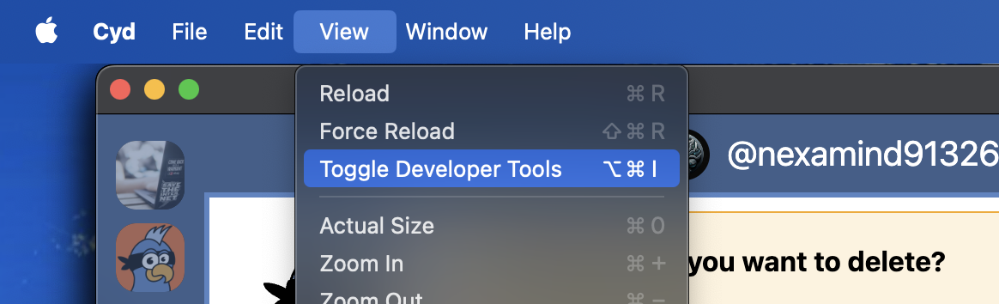

# Troubleshooting Cyd

If Cyd is acting weird, gets stuck, or appears to have crashed, this page describes ways to troubleshoot the problem. If you contact us for help, we might refer you to this page.

## Check the Developer Tools Console

Open Cyd. Click the **View** menu, and choose **Toggle Developer Tools**.

:::info Finding the View menu
If you're using a Mac, the **View** menu button will be at the very top of your screen. If you're using Windows or Linux, the **View** menu button will be at the top of the Cyd window.
:::

This will open the Developer Tools panel on the right side of the Cyd window. At the top of the panel there are different tabs. Click the **Console** tab. This will show you

Whenever Cyd does anything, it will output logs to the Console. And if Cyd encounters an error, an error message will be printed in the Console too.

To save a copy of your console log, right-click in the Console panel and choose **Save as...**. You can save a log file, which you can then email to us. You can also take a screenshot of the error you're encountering and email that to us.
