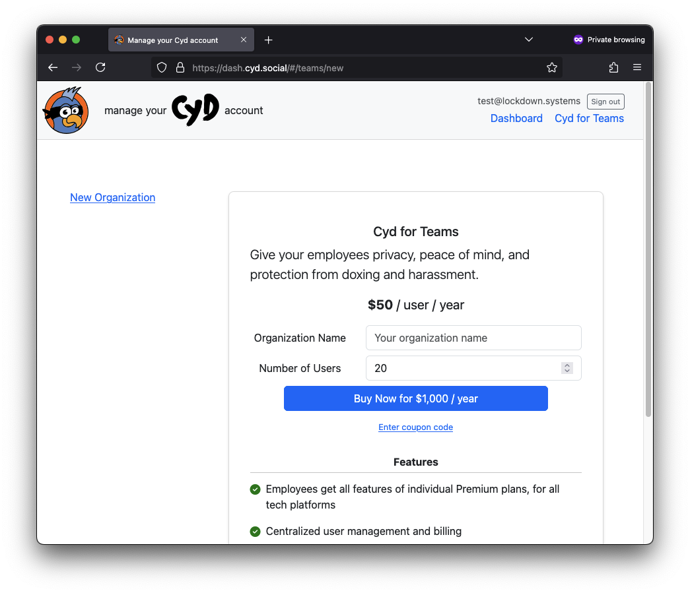

# Sign Up

To sign up for Cyd for Teams, go to the [Cyd Dashboard](https://dash.cyd.social/) and sign up with an email address.

Once you've loaded the Cyd Dashboard, click the **Cyd for Teams** link in the navigation bar at the top of the page. You will see a form for creating a new organization like this:

Give your organization a name, choose the number of seats you would like to purchase (you can always increase or decrease this later on), and click the **Buy Now** button.

And that's it! You've created an organization and purchased Cyd for Teams seats. See [Teams Dashboard](./dashboard) to learn how to manage your Cyd for Teams account.
