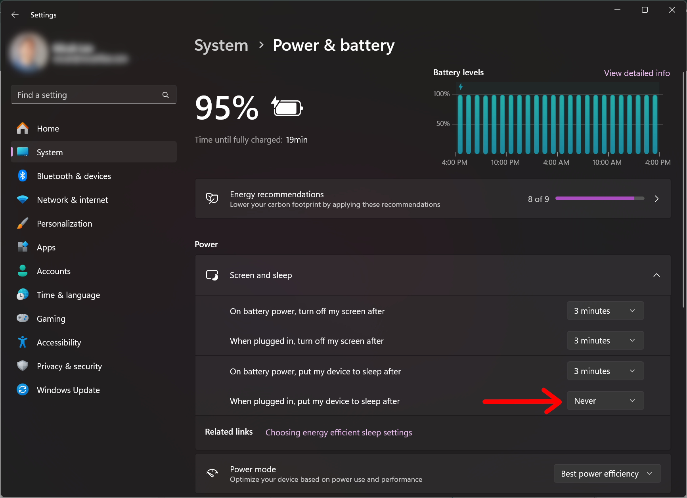

# Disable Sleep in Windows

Cyd runs directly on your computer. If you need to run it for hours or days (X has some annoying rate limits, so this is possible), you should prevent your computer from going to sleep while it's working.

Follow these instructions to prevent your computer from going to sleep in Windows 11.

First, make sure your computer is plugged in while running a Cyd job.

Second, make sure your computer does not automatically go to sleep after being idle when plugged in:

- Open the **Settings** app
- Click the **System** tab on the left panel
- Click **Power & battery**
- Expand **Screen and sleep**
- Make sure the settings include:
  - When plugged in, put my device to sleep after: **Never**

Now you can safely run Cyd for an extended period of time.

:::warning Keep your laptop lid open

Note that your computer will still go to sleep if you close the laptop lid. So, don't close your laptop while you're doing a long-running Cyd session.

:::