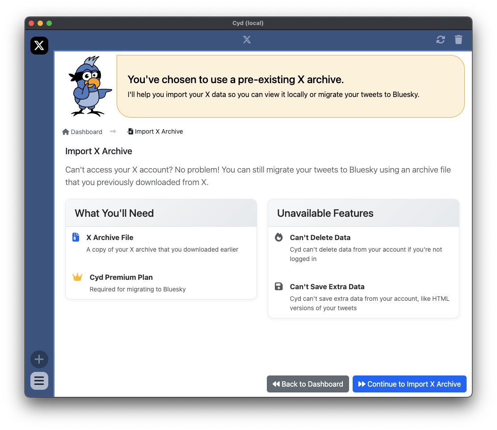
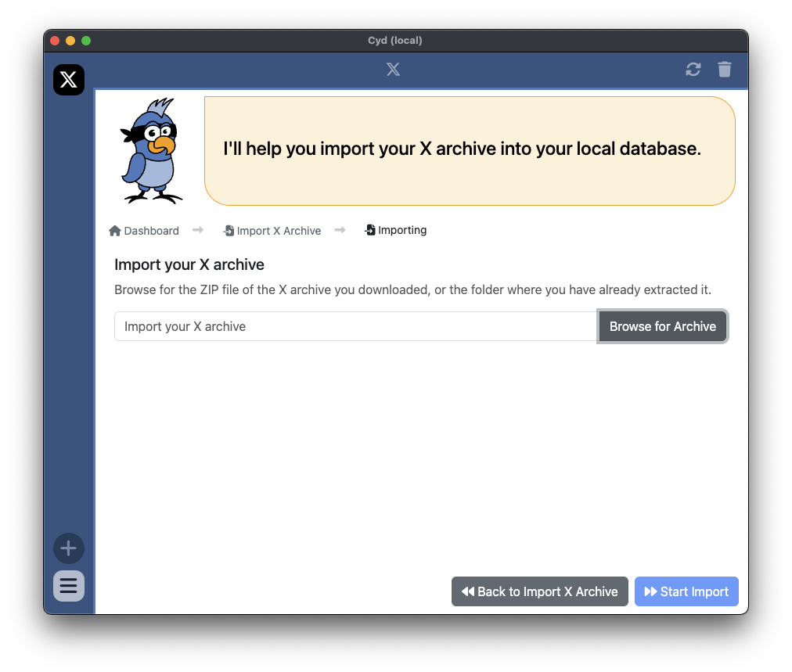
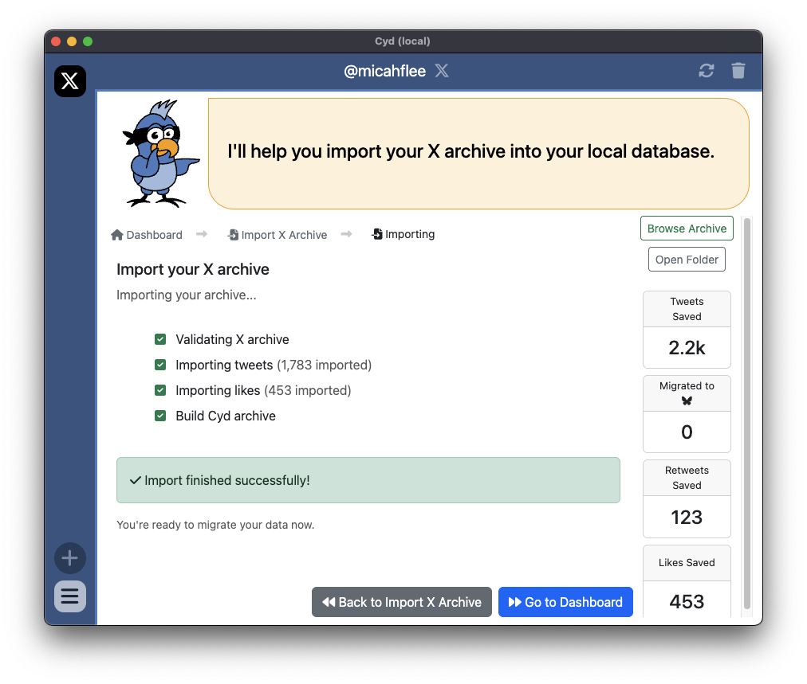
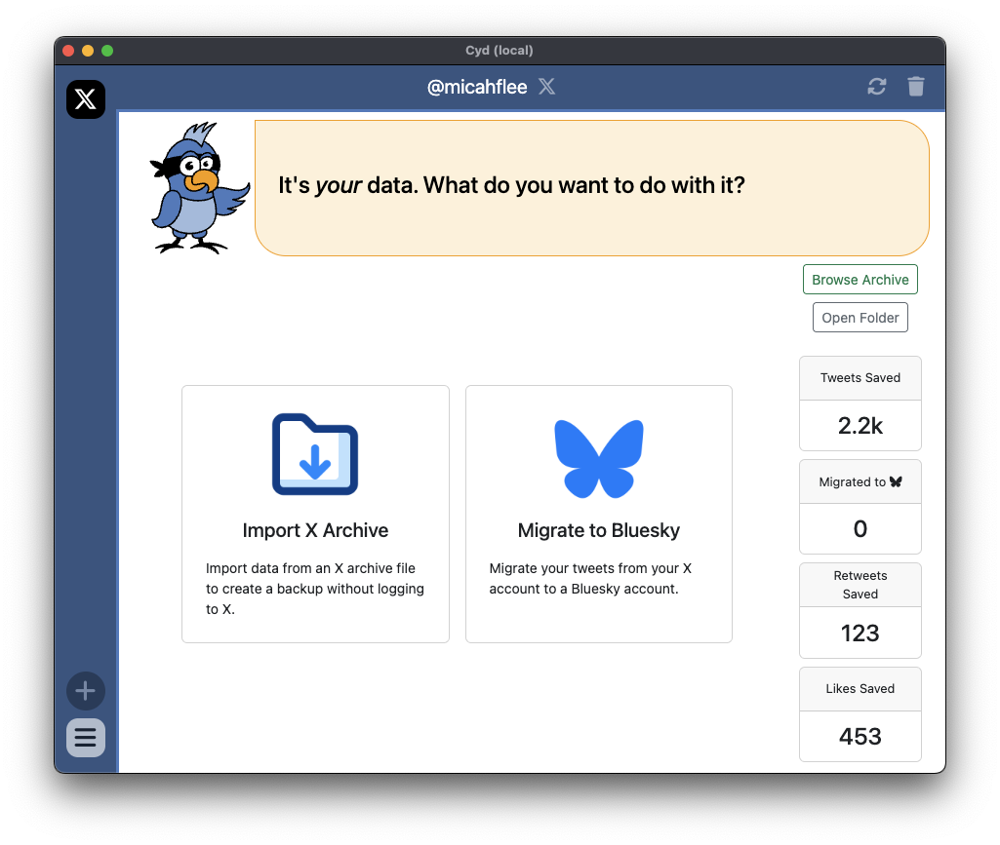

# Archive Only Mode

Archive Only Mode is a limited version of Cyd that lets you use the features that are possible without having access to sign into an X account. If you can still sign into your account, [continue to Dashboard](./dashboard.md) instead.

To continue, you'll need to have already [requested your X archive](https://help.x.com/en/managing-your-account/how-to-download-your-x-archive) from X, and then downloaded it, before deleting your X account.

And in order to migrate your tweets to Bluesky, you'll also need a Cyd [premium plan](../premium/intro.md).

Start by clicking Continue to **Import X Archive**.

From here, browse for your X archive, and then click **Start Import**.

After the import succeeds, click Go to Dashboard. When you're in Archive Only Mode, the dashboard is limited to only features that work without a signed in X account, which right now is just Migrate to Bluesky.

Click **Migrate to Bluesky** to migrate your tweets to Bluesky. For more information, see [Migrate to Bluesky](./migrate-bluesky.md).
