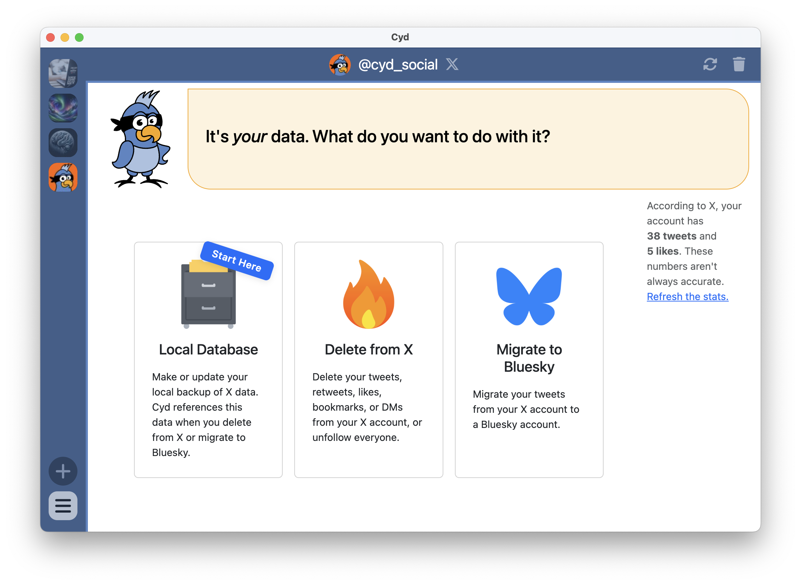

# Dashboard

After signing in to your X account, you'll see that the main panel shows you a Dashboard that allows you to naviate between the different features:

- [Local Database](./local-database/intro.md)
- [Delete from X](./delete)
- [Migrate to Bluesky](./migrate-bluesky)

The main panel has a right sidebar that includes an estimate of the number of tweets and likes in your X account. While these numbers are often close to your actual number of tweets and likes, they are often inaccurate.

Cyd needs to know what's in your X account before it can delete your data from X or migrate it to Bluesky. Because of this, you must build a [Local Database](./local-database/intro.md) before anything else.
