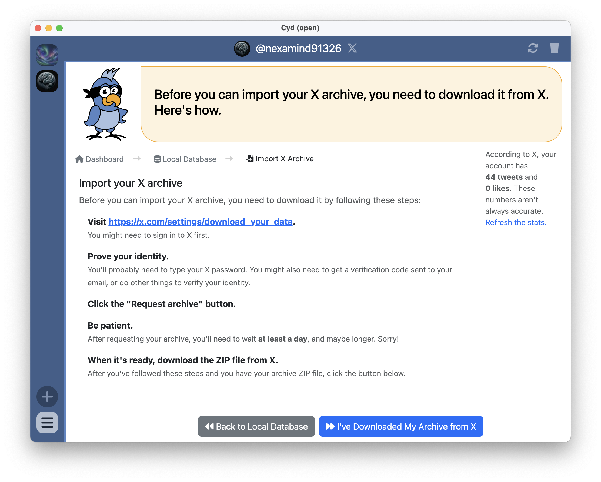
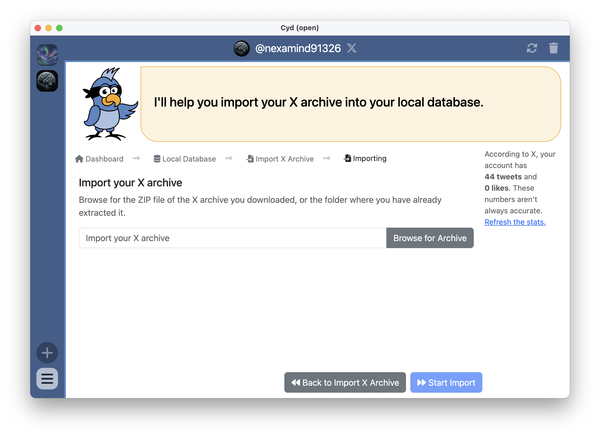

# Import X Archive

If you have enough tweets or likes that building your archive from scratch won't work, you should import your X archive instead. X allows you to [request an archive of your data](https://help.x.com/en/managing-your-account/how-to-download-your-x-archive). This process takes time &mdash; typically at least a day, and sometimes longer.

## Downloading Your Archive

When you start downloading your archive, Cyd gives you the following instructions:

For your convenience, here are the instructions:

- **Visit https://x.com/settings/download_your_data.** You might need to sign in to X first.
- **Prove your identity.** You'll probably need to type your X password. You might also need to get a verification code sent to your email, or do other things to verify your identity.
- **Click the "Request archive" button.** Be patient. After requesting your archive, you'll need to wait *at least a day*, and maybe longer. Sorry!
- **When it's ready, download the ZIP file from X.** After you've followed these steps and you have your archive ZIP file, click the button below.

After requesting your archive, wait for an email from X. It should look something like this:

Click the **download** link, or load https://x.com/settings/download_your_data again, to download your archive. There should be a Download **archive button**, like this:

When you download your archive, you will download a ZIP file.

:::warning Are you using Safari?

If you use Safari in macOS, when you download your archive ZIP file, your Mac will automatically unzip it.

Cyd can import either an archive ZIP file, or an already-unzipped archive folder.

:::

## Importing Your Archive

Once you've downloaded your X archive, click the **I've Downloaded My Archive from X** button in Cyd. You will see a screen like this:

Browse for the X archive that you downloaded &mdash; either the ZIP file, or an unzipped folder will work. Then click **Start Import**.

## Finished

Cyd will validate that the archive actually appears to be an X archive and belongs to this X account. Assuming everything went well, Cyd will import the data from it into your local database. If something went wrong, Cyd will display an error message with more details.

In the right sidebar, you will also see the buttons **Browse Archive** and **Open Folder**. See [Browse Your Local Archive](../archive) for more information about these.

There is also a summary of the amount of data in your local database. In the screenshot above, you can see the local database contains 76 saved tweets, 38 saved retweets, and 207 saved likes. So far, none of the tweets have been migrated to Bluesky.

:::tip The official X archive is missing some data

X only gives you some of your data when you request an archive. Click **Continue to Archive Options** if you'd like to download data that's missing from the official X archive. You'll be able to save your bookmarks, save HTML versions of your tweets, and download a robust backup of your direct messages from there.

:::