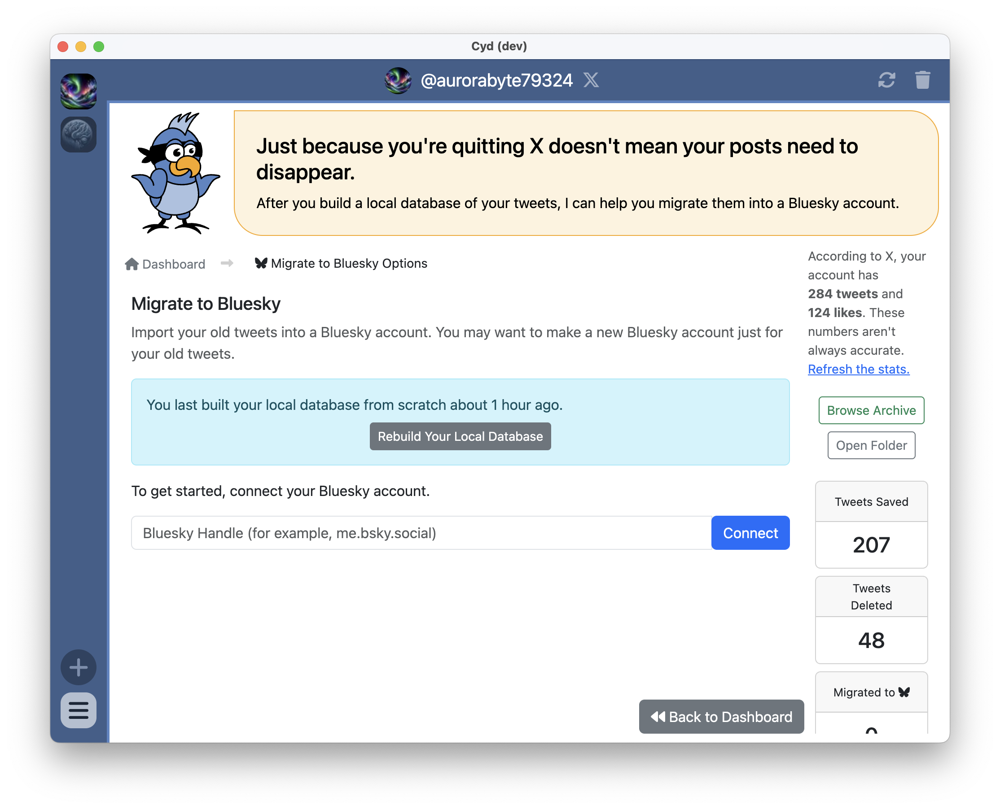
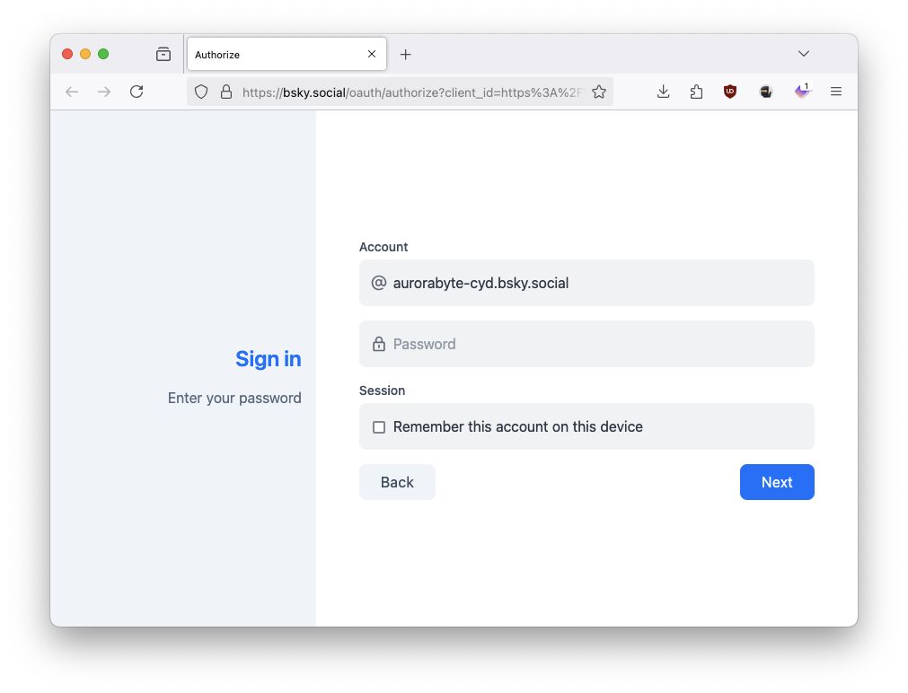
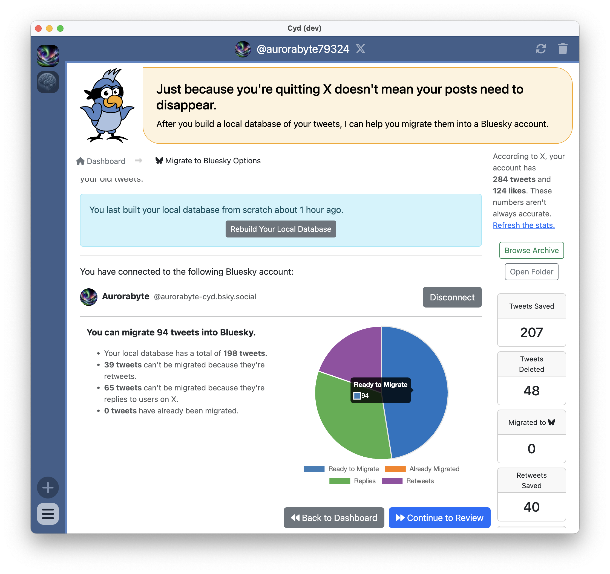
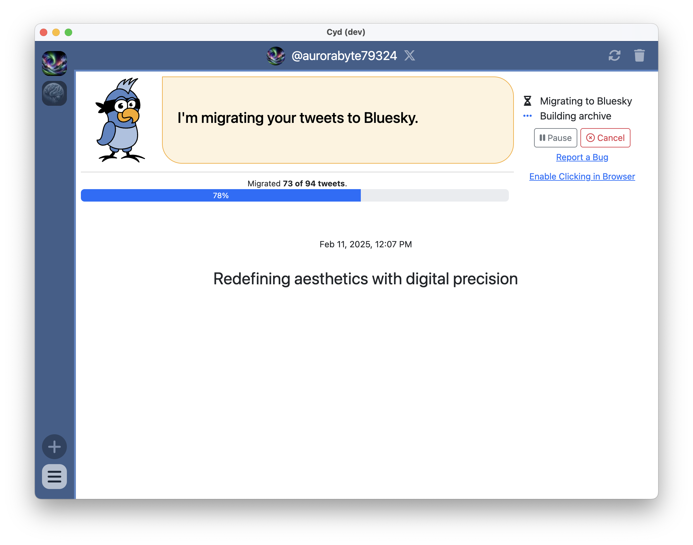
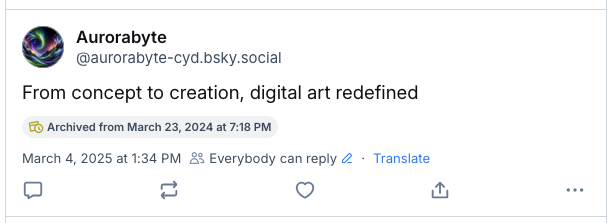
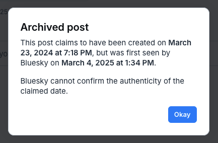
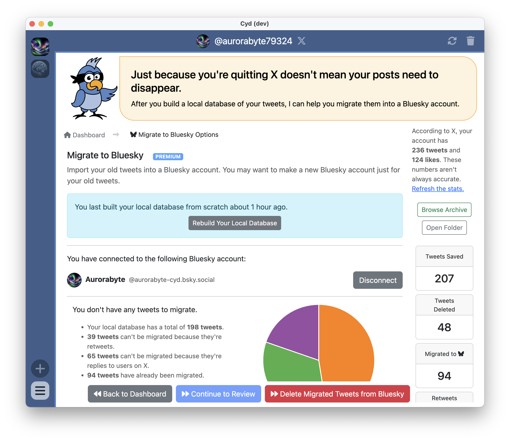

# Migrate to Bluesky

Once you've built your local database, Cyd can help you migrate your old tweets into Bluesky!

:::info Cyd will only migrate tweets where it makes sense

Cyd won't migrate retweets (that wouldn't make sense), and it won't migrate tweets that are replies to users on X (that also wouldn't make sense.) But it will migrate the rest of your own tweets, including replies to yourself. This means that your old Twitter threads will stay intact.

Cyd will also migrate images and videos to Bluesky.

:::

:::tip Create a new Bluesky account for your archive of tweets

While you can migrate your tweets into your main Bluesky account if you want, we recommend that you create a new Bluesky account just for your old archive. This way you can make it clear in this account's name and profile that it's an archive from X.

:::

## Connect a Bluesky Account

When you click the **Migrate to Bluesky** button, you'll see the following welcome screen.

Type your Bluesky handle and click **Connect**.

This will open a link in your web browser prompting you to login to your Bluesky account:

- Enter your password and click **Next**.
- On the next page, click **Accept**.
- You will get redirected to the Cyd website which will prompt you to open Cyd. Open it.

If all went well, your Bluesky account will now be connected to your X account in Cyd.

## Review your Data

After you connect a Bluesky account, Cyd will show you a pie chart of all of your tweets including which ones are ready to migrate, which are already migrated, which are replies, and which are retweets.

When you're ready to migrate your tweets, click **Continue to Review**. If all looks good, click **Start Migrating**.

:::info Migrating to Bluesky is a Premium feature

You need a [Premium plan](../premium/intro) to migrate your tweets to Bluesky. If you don't have one yet, when you click **Start Migrating** you will be prompted to sign up for one to continue.

:::

## Migrating Tweets to Bluesky

You can watch your tweets quickly flash by on the screen as Cyd posts them to Bluesky.

:::warning Rate limits

Cyd migrates your tweets to Bluesky as fast as it can, but Bluesky imposes limits on how fast this is. You're allowed to post 1,666 times in an hour, and 11,666 times in a day. [Read more](https://docs.bsky.app/docs/advanced-guides/rate-limits) about Bluesky's rate limits.

If you hit a rate limit, Cyd will wait for it to expire. Typically, you will need to wait about an hour before Cyd will automatically proceed.

:::

## Finished

When Cyd is done migrating your tweets, it shows you a summary of what it just did:

Cyd also updates your local archive again to include links to all of your migrated tweets on Bluesky.

## Tips

### Links, Media, Threads, Quotes, and Long Tweets

When Cyd migrates your tweets to Bluesky, it does its best to keep everything the same:

- **URL tracking is removed.** If your tweet includes links, those links are transferred over to Bluesky except without X's `t.co` URL tracking. The only exception is, if the URL you posted is exceptionally long and doesn't fit in a Bluesky post, Cyd will fallback to using the `t.co` link simply because it's shorter.
- **Media is preserved.** If you post images or videos, those images and videos are re-posted to Bluesky. The only exception is if the original media is too large to upload to Bluesky. Bluesky has a limit of about 1 MB for images and about 50 MB for videos.
- **Videos need time to process.** Videos on Bluesky might not work immediately after migrating them from tweets. If this happens, wait a few minutes for Bluesky to finish processing the video, and then they should play.
- **Threads are preserved.** If you posted a Twitter thread (which is just posting replies to your own tweets), they will get migrated as replies to your own posts in Bluesky.
- **Self-quote tweets are preserved.** If you quote tweet your own tweet, they will get migrated as quote posts of your original post in Bluesky.
- **Other quote tweets are not preserved.** If you quote tweet someone else, the link to the tweet you're quoting will get added to the end of your Bluesky post as a URL.
- **Mentions are not preserved.** If you mention X users, their usernames will be in the text of your Bluesky post, but you won't be able to click it to see who they are.
- **Long tweets get split into multiple Bluesky posts.** The length of a tweet on X and a post on Bluesky are calculated slightly differently, and they also have different maximum lengths. If, for whatever reason, a tweet you're trying to migrate does not fit on Bluesky, Cyd will automatically split it into two posts for you and post them both.

### Your Bluesky Posts are Backdated

After Cyd migrates a tweet to Bluesky, Bluesky keeps track of two separate timestamps:

- When the post was created on Bluesky (the post timestamp)
- When the post was originally posted to Twitter/X (the archived timestamp)

When you're viewing the posts in your Bluesky profile, it will show the post timestamp next to each post. However, if you click on a post, it will show both the post timestamp and the archive timestamp. For example, look at the following Bluesky post:

Beneath the post text it says, "Archived from March 23, 2024 at 7:18 PM" &mdash; this is the archived timestamp. But under that it says, "March 4, 2025 at 1:34 PM" &mdash; this is the post timestamp. If you click on the archive timestamp, it shows more details:

Because Bluesky can't confirm that the archived timestamp is authentic, it shows this warning. This is just how backdated posts in Bluesky work.

### Getting Interrupted and Starting Over

If, for whatever reason, you cancel migrating tweets in the middle, that's no problem. Just start migrating them again and they will continue where you left off.

And if you want to delete all of your migrated tweets from Bluesky and start over, that's easy too. After you have migrated any tweets, a **Delete Migrated Tweets from Bluesky** button will appear.

This will just delete the Bluesky posts that have been migrated from this specific X account.
